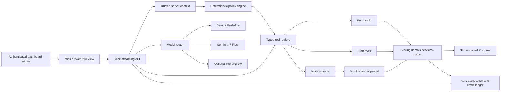

# Mink AI Dashboard Agent — Architecture and Delivery Plan

> **Status:** Phases 0–4, Phases 5A–5F, Phases 6A–6E, Phases 7A–7D and Phase 8A are implemented in code. Phase 2
> remains the invited read-only merchant beta. Phase 3 adds a separate,
> fail-closed operator opt-in
> for private versioned drafts and atomic weighted credits through migration
> `20260830_0040_mink_phase_3`. Phase 4A adds separately gated, explicitly
> approved description/SEO updates through migration
> `20260830_0042_mink_phase_4a_product_actions`. Migration
> `20260830_0043_mink_phase_4b_4d_actions` adds 4B unpublished draft-product
> creation, 4C disabled/hidden coupon create/update, and 4D customer-group
> metadata create/update. Migration
> `20260831_0046_mink_phase_5a_inventory_actions` adds one independently gated,
> explicitly approved tracked-SKU adjustment at one exact active location.
> Migration `20260831_0047_mink_phase_5b_bulk_inventory` adds a separate,
> five-credit, maximum-20-line bulk adjustment with line-level validation and
> atomic all-or-nothing execution. Migration
> `20260831_0048_mink_catalog_health_ui` documents the aligned location-aware
> sellable-SKU catalogue health card and safe structured answer renderer.
> Migration `20260831_0049_mink_inventory_scope_clarification` adds explicit
> inventory intent, multiple-choice clarification and bounded per-location
> comparison. Migration `20260901_0050_mink_full_view_takeover` makes maximize
> cover the complete browser viewport, including dashboard chrome. Migration
> `20260902_0056_mink_mobile_workspace_help` hardens that workspace on phones:
> history starts closed, the composer does not trigger iOS focus zoom, and the
> conversation is the only active scroll surface. Migration
> `20260901_0051_mink_phase_5c_order_status` adds the separately gated exact
> one-step online-delivery order transition. Migration
> `20260901_0052_mink_phase_5d_blog_publication` adds one separately gated,
> explicitly approved immediate or scheduled blog publication. Migration
> `20260901_0053_mink_phase_5e_campaigns` adds a separately gated exact
> coupon-email audience snapshot, non-PII branded sample, final human send
> confirmation and schedule-aware delivery through the existing email queue.
> Migration `20260901_0054_mink_phase_5f_bulk_prices` adds a separately gated,
> maximum-20-line exact-SKU price proposal, impact review and atomic human
> confirmation with full target/version/price checkpoints.
> Migration `20260902_0058_mink_phase_6a_durable_workflows` adds service-only
> leased workflow runs, idempotent step/event checkpoints, cancellation,
> approval-resume state, completion notifications and the first deterministic
> read-only weekly trading report template.
> Migration `20260903_0072_mink_phase_6bc_workflows` adds the deterministic,
> read-only revenue-decline investigation and private exact-SKU product-launch
> preparation templates on the same runtime.
> Migration `20260903_0073_mink_phase_6d_slow_inventory` adds a bounded,
> location-aware slow-inventory analysis and private promotion recommendation
> with cost/margin guardrails and a separate human offer/activation boundary.
> Migration `20260903_0074_mink_phase_6e_delayed_pickups` adds a bounded,
> PII-minimized delayed-pickup review with private preparation-delay copy and
> duplicate-safe handoff to StoreMink's existing one-time reminder sweep.
> Migration `20260904_0076_mink_phase_7a_builder_context_help` documents the
> Phase 7A permission-gated, current-store Website Builder context readers and
> validation-only custom-code sandbox contract.
> Migration `20260904_0077_mink_phase_7b_storefront_code_preview` adds the
> constrained private-proposal draft kind and publishes the Phase 7B
> permission, validation, isolation, credit and no-write contract.
> Migration `20260904_0078_mink_phase_7c_builder_draft_save` adds the
> default-off action vocabulary, exact-target approval/audit constraints,
> partial indexes and guarded private Builder draft-save guidance.
> Migration `20260904_0079_mink_phase_7d_storefront_publication` adds the
> independent publication gate, full-page snapshot constraints and checked
> publication/exact-rollback Help contract.
> No transfer,
> cancellation, refund, payment/shipment/pickup/POS lifecycle mutation, product/page/
> bulk or unrestricted storefront publication, arbitrary-recipient or direct customer
> contact, membership, unbounded catalogue repricing or arbitrary-code authority is
> present.
>
> **Plan date:** 2026-09-04
>
> **Platform constraint:** Mink AI must run on Google Cloud Vertex AI / Gemini
> Enterprise Agent Platform. OpenAI models are out of scope.

### Implementation checkpoint — 2026-09-03

The current Phase 0/1/2 read slice, Phase 3 drafting slice and complete Phase 4
guarded-action slice now include:

- the official `@google/genai` SDK pinned to the supported 2.x line;
- a Vertex-only Gemini 3.7 Flash client using ADC, the stable `v1` API,
  low-level thinking and SDK-managed chat history/thought signatures;
- a reviewed human-readable system-prompt contract in
  `docs/mink-ai-system-prompt.md`, parsed as the executable runtime template by
  `lib/mink/system-prompt.ts` and tied to versioned run telemetry;
- trusted actor construction from the authenticated host, admin, database role,
  permissions and effective plan;
- a permission-filtered tool registry that rechecks authorization at execution;
- five explicitly store-scoped read tools: `get_store_profile`,
  `get_catalog_summary`, `search_products`, `get_sales_summary` and
  `list_low_stock`; sales reuse the dashboard's recognized-order, refund,
  timezone and location contract. Catalogue health separates product publication
  counts from simple-product/variant SKU stock, intersects exact location names
  with trusted admin assignments, applies Inventory's threshold rules and
  returns a bounded status-tagged list; ambiguous multi-location stock asks
  return quick clarification choices, explicit comparisons calculate every
  accessible shelf independently, and single-location stores proceed directly;
- a bounded multi-step orchestration loop with step, tool and parallel-read
  limits;
- an authenticated, same-origin, rate-limited SSE endpoint at
  `POST /api/mink/stream` with an abort-aware Vertex session;
- service-only, RLS-enabled persistent conversations, runs, successful-turn
  history, redacted tool telemetry and an append-only raw token ledger;
- an abortable streaming client integrated with the existing Home prompt,
  drawer and expanded view, with tool progress, Stop, Retry and safe errors;
- a store/admin-scoped ten-conversation sidebar that restores the newest
  successful transcript after refresh, supports confirmed deletion, and
  atomically removes the oldest thread when an eleventh is created;
- a resizable side panel with a browser-local width preference, the same purple
  robot identity as Help Centre Mink, an auto-growing multiline composer, and a
  safe ChatGPT-style React renderer for headings, lists, tables, code, emphasis
  and allowlisted StoreMink links without raw HTML; maximize opens a true
  viewport takeover above the dashboard topbar, navigation and page content,
  while restore returns to the remembered side-panel width. Phones use one
  dynamic-viewport full-screen surface from either entry point, start with
  history closed, keep the composer at a no-zoom 16px, and lock the dashboard
  behind the contained message scroller;
- a separate published Help Centre guide for the dashboard alpha's supported
  questions, permission behavior, privacy and limits;
- prompt-injection instructions that treat all tool values as untrusted data;
- one abort-aware retry for transient model failures, bounded tool timeouts, a
  hard run timeout and safe public errors while details remain in server logs;
- complete/partial/unavailable usage states with a versioned micro-USD Gemini
  3.7 Flash shadow estimate (unknown usage is never presented as free);
- a page-gated operator inspector at `/dashboard/mink` for redacted status,
  latency, retries, tool names, tokens and cost—never conversation content or
  provider reasoning;
- a 73-case live evaluation corpus and `npm run mink:eval` gate for tool choice,
  security refusals, malformed calls, latency and manual grounding review;
- a phase-wise manual acceptance catalogue in
  `docs/mink-ai-test-prompts.md` covering read prompts, runtime UX, permissions,
  tenancy, drafting, credits, exact approvals, concurrency, rollback and
  unsupported-action refusals; and
- focused tests for config fail-closed behavior, actor construction,
  authorization/permission matrices, location scope, tenant-free tool schemas,
  retry/cost logic, agent limits, operator filters and the SSE boundary;
- operator-managed, per-store beta invitations in addition to the global kill
  switch;
- order list/current-order and selected-product reads with tenant revalidation,
  location scoping and minimized/masked customer data;
- unambiguous location name/type aliases such as `Delhi warehouse`, resolved
  only inside the admin's trusted accessible-location scope; a failed named
  location is never retried as an all-location request;
- rich metric, order, product, inventory and Help-source cards that repeat the
  applied date, location and channel scope;
- normalized current-page/selected-record context, never trusted as identity;
- published Help Centre hybrid lexical/vector retrieval as a bounded tool;
- deterministic extractive compaction after 16 messages while retaining the
  newest eight messages verbatim;
- actor-owned answer feedback with bounded, privacy-redacted issue detail and
  operator-visible trace correlation; and
- shadow credit weights and cost cohorts stored with each read usage row;
- an independent per-store drafting-beta switch controlled by a platform
  superadmin;
- product-description, product-SEO, blog, coupon-email and reusable
  customer-message proposal tools filtered by Manage permission;
- store brand voice carried as untrusted style context, never authority;
- an expected weighted-credit preview in the composer and atomic server-side
  2/1/5/2/2/3/1/1/1/1 charging from monthly allowance then credit balance;
- editable before/after proposal cards, admin-private persistence, optimistic
  version saves and append-only rollback history;
- atomic compensation that discards an unseen proposal and restores its exact
  plan/balance credits when the enclosing run fails or is cancelled; and
- explicit absence of any model tool that publishes, sends, contacts a
  customer or performs a general live-record write;
- independent operator kill switches for product-description and product-SEO
  actions, automatically shut when the parent beta or drafting gate closes;
- saved-draft-only exact previews bound to the actor, tenant, draft version,
  product content version, tool version and before/after field values;
- an execute API that accepts only the approval id, writes only the approved
  description or SEO fields in one transaction, and is idempotent under retry;
- fail-closed concurrent edit/expiry handling with one append-only outcome row;
- result cards linking to the product plus a second explicitly approved safe
  rollback while the product still matches its post-action checkpoint; and
- cache invalidation and the standard product-updated event only after commit;
  and
- redacted operator counts for action-enabled stores, executed actions and
  refused conflicts/expiries without approval content;
- charged private proposals for unpublished draft-product creation, disabled
  coupon create/update and customer-group metadata create/update;
- five additional independent live-action kill switches, with Manage
  permission rechecked at both preview and execution;
- a human-only action endpoint for those domains that accepts ids and
  versions, never browser-supplied business fields;
- forced product draft/untracked state and forced coupon disabled/hidden state
  shown in exact previews, while coupon usage/audience and group membership
  remain outside the write allowlist; and
- safe create rollback only while the new record is unchanged and unused,
  plus checkpointed update rollback for coupon terms and group metadata.
- independent one-line and maximum-20-line inventory proposal gates with exact
  trusted SKU/location checkpoint resolution and no model-callable executor;
- five-minute bulk review, deterministic row locking and all-or-nothing stock,
  movement and audit writes when every line still matches; and
- strict same-origin, streamed byte, field, rate, tenant and permission
  boundaries around the human-only bulk preview/execute endpoint.

The dev deployment has also passed manual acceptance for ten-conversation
history, conversation deletion, panel resizing, multiline input growth and
cross-tenant isolation. These checks validate the internal-alpha UX/security
slice; they do not replace the evaluation and production-readiness gates below.

The real client and endpoint are globally enabled when `MINK_AI_ENABLED` is
unset and can be explicitly disabled with `MINK_AI_ENABLED=false`. With the
default `MINK_BETA_REQUIRE_INVITE=true`, a store must still have an enabled
operator invitation. Draft tools additionally require
`drafting_enabled=true` and the related Manage permission. Every Phase 4 or 5
action also requires its matching per-tool operator switch and the destination
section's Manage permission. The
disabled/uninvited state keeps the canned coming-soon response. The current
build charges live credits only when it creates a private proposal; the
weighted schedule is 2/1/5/2/2 for the original proposal kinds, 3 for a draft
product, 1 each for coupon or customer-group create/update, 1 for a single
inventory adjustment and 5 for a maximum-20-line bulk inventory proposal.
Human review/execution adds no model generation charge. It does not
stream token deltas, expose raw customer contact details, perform coding work,
publish products, activate coupons, alter non-approved fields or change group
membership. The 50 cases are the
first comparison set, not the complete 200-case Phase 0 corpus, and still need
controlled live execution and cost reconciliation. Code-complete phases are
not automatically deployed or accepted by those facts.

The post-Phase-4 reliability review is implemented in code: proposal artifacts
survive both live SSE parsing and retained-history restoration; disabling the
invitation-only rollout preserves each store's independent drafting switch;
PostgreSQL timestamp checkpoints keep microsecond precision through the driver;
and coupon business dates are canonicalized before exact value comparison.
This closes false apply/rollback conflicts without weakening real concurrent
edit detection. Migration `20260830_0044_mink_action_reliability_help` keeps the
published merchant guidance aligned with that contract.

## 1. Executive decision

Build Mink AI as a **permission-aware operating agent for each StoreMink
merchant**, not as an unrestricted chatbot and not as a model with direct
database access.

The production model strategy is:

| Workload                                                                                   | Model                            | Thinking                                      | Launch status            | Decision                                                                           |
| ------------------------------------------------------------------------------------------ | -------------------------------- | --------------------------------------------- | ------------------------ | ---------------------------------------------------------------------------------- |
| Intent routing, summarisation, low-cost classification                                     | `gemini-3.1-flash-lite`          | Lowest supported setting                      | GA                       | Use for high-volume, low-risk model work                                           |
| Normal business questions, analysis, tool selection, multi-step actions, storefront coding | `gemini-3.7-flash`               | `LOW` or `MEDIUM`; `HIGH` only when justified | GA                       | **Primary Mink AI model**                                                          |
| Exceptionally difficult planning or reasoning                                              | `gemini-3.1-pro-preview`         | `HIGH`                                        | Preview                  | Evaluation-only escalation behind an operator flag; never a launch dependency      |
| Existing Help Centre answers, copy generation and brand-voice features                     | Existing `gemini-2.5-flash` path | Existing configuration                        | Existing production path | Keep unchanged initially; migrate only through a separate regression-tested change |
| Help Centre embeddings                                                                     | Existing `gemini-embedding-001`  | N/A                                           | Existing production path | Keep the current 768-dimensional storage contract                                  |

Google describes Gemini 3.7 Flash as the Gemini 3 family's primary agentic
workhorse, with a 1,048,576-token context window, function calling, structured
output, code execution, context caching and a GA production release. It is the
right default for Mink AI. `gemini-3.1-pro-preview` is useful for benchmarking
hard cases, but a Preview model must not be required for a reliable customer
workflow.

Sources:

- [Gemini 3.7 Flash developer guide](https://docs.cloud.google.com/gemini-enterprise-agent-platform/models/guides/gemini-3-7-flash)
- [Gemini 3.7 Flash model reference](https://docs.cloud.google.com/gemini-enterprise-agent-platform/models/gemini/3-7-flash)
- [Vertex / Agent Platform function calling](https://docs.cloud.google.com/gemini-enterprise-agent-platform/models/tools/function-calling)
- [Gemini thought signatures](https://docs.cloud.google.com/gemini-enterprise-agent-platform/models/thinking/thought-signatures)
- [Google model pricing](https://cloud.google.com/gemini-enterprise-agent-platform/generative-ai/pricing)

## 2. Why Gemini 2.5 Flash should not be the dashboard agent

Gemini 2.5 Flash remains suitable for StoreMink's current bounded generation
tasks: one product description, one SEO draft, one coupon email or one grounded
Help answer. Those requests have a narrow prompt, a narrow output and no
meaningful authority.

A dashboard agent has a different job. It must:

- understand an ambiguous business request;
- select the correct StoreMink tools;
- respect the current admin's section permissions;
- preserve reasoning state across several tool calls;
- distinguish reading, proposing and changing;
- recover from partial failures without repeating mutations;
- maintain exact tenant boundaries;
- explain what it found and what it changed;
- stop for approval before a material action;
- and sometimes generate or validate storefront code.

The dashboard agent therefore gets its own runtime and model configuration. Do
not replace `GEMINI_MODEL` globally and accidentally migrate product copy, Help
generation and the new agent in one release.

## 3. Product promise and boundaries

### 3.1 Product promise

Mink AI should eventually be able to:

1. Answer questions using the merchant's live StoreMink data.
2. Explain results, trends and anomalies in plain language.
3. Draft products, pages, campaigns, blogs and operating plans.
4. Propose changes with a clear preview and impact summary.
5. Perform authorized StoreMink actions after the required approval.
6. Run long, multi-step workflows with progress, checkpoints and recovery.
7. Proactively identify useful opportunities and problems.
8. Generate and revise storefront custom-code sections in a safe preview.

### 3.2 Permanent boundaries

Merchant-facing Mink AI must never:

- receive a raw SQL, database, shell or generic server-action tool;
- accept `store_id`, admin identity or permissions from model-generated input;
- read another store, even when a user includes another store ID in a prompt;
- reveal secrets, payment credentials, session cookies or one-time codes;
- silently send a campaign, publish content, refund money, delete data, change
  staff access or alter billing;
- modify StoreMink's platform source repository or deploy StoreMink itself;
- treat a model-generated statement as evidence that an action succeeded;
- or claim a capability when the corresponding tool does not exist.

“Capable of everything” means broad coverage through reviewed StoreMink tools.
It cannot mean unlimited authority.

## 4. Current StoreMink foundation

The implementation should extend the current platform rather than create an
unrelated second system:

- `app/dashboard/dashboard-chat.tsx` already provides side-panel and expanded
  conversation surfaces.
- `app/dashboard/mink-ai.ts` selects the canned response while the server flag
  is off and the abortable SSE client while it is on.
- `app/dashboard/chat-context.tsx` already shares one conversation between the
  Home prompt and the dashboard drawer.
- `lib/ai/gemini.ts` already proves Vertex ADC calls from Cloud Run and emits
  latency/token telemetry, but its raw Gemini 2.5 request contract is not the
  new agent runtime.
- `lib/ai/brand-voice.ts` supplies per-store voice.
- `lib/ai/quota.ts`, `ai_usage`, the AI credit balance and append-only credit
  ledger provide a metering and purchase foundation.
- `app/dashboard/lib/access.ts` and `permissions.ts` are the authoritative
  merchant RBAC layer.
- `activity_events` and `recordEvent` provide the existing audit stream.
- `lib/help/` provides grounded Help retrieval and should become one read-only
  dashboard tool rather than being reimplemented.
- The Website Builder already has sandboxed custom-code sections, preview,
  CodeMirror, autosave and history primitives.

## 5. Recommended runtime architecture



### 5.1 Runtime decision

For Phases 0–5, run the TypeScript orchestrator in StoreMink's existing Cloud
Run application, using the official Google Gen AI SDK with Vertex enabled.
This keeps authorization, domain transactions and tenant context close to the
existing code and avoids introducing a second Python runtime before the tool
contracts are stable.

Evaluate managed Agent Runtime later for durable specialist agents or isolated
long-running workloads. Google supports TypeScript through a custom container
or Cloud Run, but adopting managed Agent Runtime is not required to make the
first agent reliable.

### 5.2 New model client

Create an agent-specific client instead of expanding the current raw
`callGemini` function into an incompatible abstraction.

Suggested configuration:

```text
MINK_VERTEX_MODEL=gemini-3.7-flash
MINK_VERTEX_FAST_MODEL=gemini-3.1-flash-lite
MINK_VERTEX_DEEP_MODEL=gemini-3.1-pro-preview
MINK_VERTEX_DEEP_ENABLED=false
MINK_VERTEX_LOCATION=global
MINK_MAX_STEPS_PER_RUN=12
MINK_MAX_PARALLEL_READ_TOOLS=4
MINK_RUN_TIMEOUT_SECONDS=120
```

Production authentication remains Application Default Credentials from the
Cloud Run service account. No API key is exposed to the browser.

The Gemini 3 contract differs from the current Gemini 2.5 payload:

- use `thinking_level`, not the current integer `thinkingBudget`;
- do not rely on `temperature`, `top_k` or `top_p` for Gemini 3.7 Flash;
- use strict JSON schemas and strict function-call/result matching;
- preserve opaque thought signatures across multi-step turns;
- preserve the full provider response parts or let the official SDK manage the
  history so tool reasoning does not break with a `400` error;
- cap model steps, tool calls, input rows and output size at the application
  layer even though the model supports a very large context window.

### 5.3 Do not use the million-token window as storage

The 1M context window is a capability, not a reason to send the entire store to
the model. Mink should retrieve the smallest useful, permission-filtered set of
facts. Large unfiltered prompts increase cost, latency, privacy risk and prompt
injection exposure.

## 6. Trusted context and tenancy

Every run begins with a server-created `MinkActorContext`:

```ts
interface MinkActorContext {
  storeId: string;
  adminId: string;
  email: string | null;
  roleId: string | null;
  permissions: Record<string, { view: boolean; manage: boolean }>;
  effectivePlan: "free" | "basic" | "pro";
  currentPath: string;
  selectedResource?: { type: string; id: string };
  requestId: string;
}
```

Rules:

1. This object is constructed after dashboard authentication and database role
   resolution.
2. It is never accepted from the browser as authoritative.
3. `storeId` and `adminId` are never function parameters exposed to Gemini.
4. Every tool receives this context out of band.
5. Every read and write explicitly scopes by `storeId` even where RLS also
   protects the table.
6. A permission read failure is an outage, not “no access.”
7. Service-role database access is used only when necessary and only after the
   tool has validated tenant, permission and arguments.

## 7. Tool system

### 7.1 Tool definition contract

Every tool should declare:

```ts
interface MinkToolDefinition<Input, Output> {
  name: string;
  version: number;
  description: string;
  inputSchema: unknown;
  outputSchema: unknown;
  risk: "read" | "draft" | "write" | "high_risk" | "forbidden";
  permission: { section: string; action: "view" | "manage" };
  minPlan?: "free" | "basic" | "pro";
  approval: "none" | "inline" | "explicit" | "fresh_auth";
  timeoutMs: number;
  maxCallsPerRun: number;
  pii: "none" | "masked" | "allowed";
  idempotent: boolean;
  execute(context: MinkActorContext, input: Input): Promise<Output>;
}
```

Additional invariants:

- Tools return bounded structured JSON, never a database object or arbitrary
  HTML.
- Tool descriptions explain side effects and failure states.
- Validation happens before any external call or transaction.
- A tool result distinguishes `success`, `declined`, `not_found`, `conflict`,
  `unavailable` and `unknown_outcome`.
- An unknown external payment or shipping outcome is never converted to a
  failure or success by the model.
- Parallel calls are allowed only for read tools.
- A mutation tool cannot call another mutation tool invisibly.

### 7.2 Initial read tools

- `get_store_overview`
- `get_sales_summary`
- `compare_sales_periods`
- `list_recent_orders`
- `get_order_detail`
- `list_low_stock`
- `get_inventory_position`
- `get_product_detail`
- `list_top_products`
- `get_customer_summary`
- `list_customer_segments`
- `get_campaign_performance`
- `get_search_performance`
- `find_help_guides`
- `get_current_page_context`

Each answer derived from business data must include the date range, currency,
store/location scope, data freshness and links to the relevant dashboard view.

### 7.3 Draft tools

- `draft_product_copy`
- `draft_product_seo`
- `draft_blog_post`
- `draft_coupon_campaign`
- `draft_customer_message`
- `propose_price_changes`
- `propose_inventory_adjustments`
- `propose_customer_group`
- `propose_navigation_changes`
- `propose_builder_section`

Draft tools do not publish and do not require the model to pretend that a draft
has been applied.

### 7.4 Mutation tools

Introduce one domain at a time:

- `create_product_draft`
- `update_product_fields`
- `adjust_inventory_at_location`
- `create_coupon_draft`
- `save_customer_group`
- `schedule_blog_publish`
- `save_navigation_draft`
- `save_builder_section_draft`
- `publish_approved_builder_version`

Later, after domain-specific acceptance testing:

- `update_order_status`
- `schedule_campaign_send`
- `bulk_update_prices`
- `bulk_adjust_inventory`
- `prepare_refund_request`

Refund execution, staff roles, plan/billing changes, payment credentials,
domain ownership, store deletion and arbitrary exports remain unavailable until
a separate threat model explicitly authorizes them. Some should remain
permanently manual.

## 8. Approval and risk model

| Tier                | Examples                                                                                 | Required behavior                                                                                              |
| ------------------- | ---------------------------------------------------------------------------------------- | -------------------------------------------------------------------------------------------------------------- |
| R0 — read           | Metrics, lists, explanations, navigation                                                 | Execute without confirmation if the user has `view` permission                                                 |
| R1 — draft          | Copy, report, proposed group, unpublished section                                        | May create a reversible draft; clearly label it as a draft                                                     |
| R2 — material write | Product edit, inventory adjustment, coupon creation                                      | Render exact before/after preview; explicit confirmation bound to exact arguments                              |
| R3 — high risk      | Bulk prices, campaign send, publish, order state, refund preparation                     | Owner/authorized manager, fresh data read, impact summary, explicit confirmation; fresh auth where appropriate |
| R4 — prohibited     | Secrets, raw SQL, staff escalation, billing credentials, store deletion, platform deploy | Do not expose a tool                                                                                           |

An approval record must be bound to a hash of:

- tool name and version;
- normalized arguments;
- store and actor;
- records and versions read for the preview;
- quoted financial/customer impact;
- and expiration time.

If any input changes after approval, the approval is invalid and a new preview
is required. “Yes” in an unrelated later conversation must never approve a
stale action.

## 9. Proposed persistence model

All new tenant data requires `store_id`, indexes and RLS. Use forward-only
migrations.

### `mink_conversations`

- `id`
- `store_id`
- `admin_id`
- `title`
- `status` (`active`, `archived`, `deleted`)
- `last_message_at`
- `expires_at`
- timestamps

### `mink_messages`

- `id`
- `store_id`
- `conversation_id`
- `run_id`
- `role`
- `content_json`
- `provider_state_json` for opaque Gemini parts/thought signatures
- `model`
- `created_at`

Never parse, display or log opaque thought-signature contents.

The alpha schema creates this field for future opaque provider-state replay but
currently persists only final user/assistant text. Within a live run the
official SDK owns the exact function-call parts and thought signatures.

### `mink_runs`

- `id`
- `store_id`
- `conversation_id`
- `requested_by`
- `status` (`queued`, `running`, `waiting_approval`, `succeeded`, `failed`,
  `cancelled`, `unknown_outcome`)
- `model`, `thinking_level`, prompt/tool registry versions
- `risk_tier`
- input/output/cached/thinking token counts
- estimated provider cost and charged credits
- latency, step count, error code
- idempotency key and timestamps

The alpha implements the `running`, `succeeded`, `failed` and `cancelled`
subset plus token counts, steps, tools, latency and error code. Queuing,
approval pauses, unknown external outcomes, cost estimates and idempotent
mutation fields arrive with the relevant later phases.

### `mink_tool_calls`

- run and sequence IDs
- tool name/version
- redacted arguments and bounded result summary
- status and risk
- permission checked
- approval ID
- idempotency key
- started/completed timestamps and error code

### `mink_approvals`

- run/tool call/store/actor IDs
- action hash
- preview JSON
- status (`pending`, `approved`, `rejected`, `expired`, `consumed`)
- expiry and resolution timestamps

### `mink_usage_ledger`

Append-only record of model, tokens, provider-cost estimate, tool cost, reserved
credits, final credits and reversal. This should become the source of truth for
Mink usage rather than inferring cost from chat messages.

The alpha ledger records raw token counts and zero charged credits. Provider
cost estimates, reservations, reconciliation and reversals are intentionally
not active until pilot distributions are measured.

### `mink_memories` — not before the proactive phase

Only store explicit, user-approved business preferences. Do not create inferred
long-term memory from customer data, private messages or credentials.

## 10. Conversation and streaming protocol

Target protocol:

1. The browser sends the message, current route and optional selected record.
2. The server reconstructs identity, tenant and permissions.
3. The server creates a run and reserves a bounded number of credits.
4. The router selects model and thinking level.
5. The server streams typed events:
   - `message_delta`
   - `status`
   - `tool_started`
   - `tool_completed`
   - `approval_required`
   - `usage`
   - `completed`
   - `failed`
6. Tool calls loop through deterministic validation and policy checks.
7. Opaque provider parts and thought signatures are replayed exactly.
8. Final usage reconciles the reservation; unused credits are released.
9. The UI renders facts, sources, planned actions and completed actions as
   separate visual blocks.

The flag-enabled `useMinkAi` path now uses an abortable streaming client;
closing the drawer does not cancel a run, while explicit Stop does. The
flag-disabled path deliberately retains the timed canned response.

The current alpha implements the abortable transport with coarser
`status`/`tool`/`message`/`usage`/`done` events and one final assistant message.
It creates and commits the run before returning completion, retains the newest
ten conversations per actor/store, restores the latest thread after refresh,
and treats explicit Stop as cancellation. Delta rendering, background
continuation and approval-required events remain later work.

## 11. Model routing policy

Model selection is application policy, not model choice.

### Flash-Lite

Use for:

- title generation;
- topic/risk classification;
- summarising already-grounded tool results;
- extracting structured filters from a simple request;
- and low-risk Help/navigation questions.

Flash-Lite never directly authorizes a mutation.

### Gemini 3.7 Flash

Use as the normal agent for:

- business questions requiring several reads;
- analytics interpretation;
- tool selection;
- proposal generation;
- mutation planning and post-approval execution;
- long workflows;
- and storefront code generation/revision.

Default `thinking_level`:

- `LOW`: simple question, one read tool, short result;
- `MEDIUM`: ordinary analysis, tool workflow or action proposal;
- `HIGH`: hard anomaly analysis, complex code or a workflow that failed its
  first plan.

Do not retry by increasing thinking indefinitely. One controlled escalation is
the maximum.

### Gemini 3.1 Pro Preview

Use only when all of the following are true:

- the operator flag is enabled;
- the store/plan is eligible;
- the run is non-critical or still requires human approval;
- 3.7 Flash evaluation has shown a real quality gap;
- and the customer-visible workflow has a 3.7 Flash fallback.

Never use Preview Pro as the sole model capable of completing a paid feature.

## 12. Cost and credit model

### 12.1 Provider pricing baseline

As of the plan date, Google lists these global standard prices per one million
tokens:

| Model                  | Input | Cached input | Output/reasoning | Pricing note                            |
| ---------------------- | ----: | -----------: | ---------------: | --------------------------------------- |
| Gemini 3.1 Flash-Lite  | $0.25 |       $0.025 |            $1.50 | Cost-sensitive routing model            |
| Gemini 3.7 Flash       | $0.75 |       $0.075 |            $3.75 | Introductory pricing through 2026-12-31 |
| Gemini 3.7 Flash       | $1.50 |        $0.15 |            $7.50 | Published price from 2027-01-01         |
| Gemini 3.1 Pro Preview | $2.00 |        $0.20 |           $12.00 | Up to 200K input tokens                 |

Price the StoreMink product against the **post-promotion 3.7 price**, not the
temporary 2026 discount. For input contexts above 200K, Google applies the
published long-context rate to the whole request. Keep normal Mink runs far
below this threshold.

At a planning conversion of ₹90/USD:

| Example                                          | Raw model cost now | Post-promotion planning cost |
| ------------------------------------------------ | -----------------: | ---------------------------: |
| Flash-Lite quick task: 4K input + 500 output     |              ₹0.16 |                        ₹0.16 |
| 3.7 normal agent task: 12K input + 2K output     |              ₹1.49 |                        ₹2.97 |
| 3.7 substantial code task: 50K input + 8K output |              ₹6.08 |                       ₹12.15 |
| Pro Preview hard task: 12K input + 2K output     |              ₹4.32 |                        ₹4.32 |

Add a 30–40% operating buffer for retries, Cloud Run, database queries,
storage, observability, taxes, payment fees and support.

Google Search grounding includes a shared free allowance and is then priced per
grounding query. It must be opt-in for a user request that needs current public
information; StoreMink business questions should use StoreMink data instead.

### 12.2 Credits

Keep one existing credit equal to one existing lightweight generation so past
buyers do not lose value. Agent tasks spend a documented weighted number of
credits:

| Work                                 |                         Initial debit |
| ------------------------------------ | ------------------------------------: |
| Flash-Lite lookup or classification  |                              1 credit |
| 3.7 business analysis                |                             3 credits |
| 3.7 material action through approval |                             5 credits |
| Pro/deep reasoning escalation        |                             8 credits |
| Google Search grounding              |        +2 credits per grounding query |
| Moderate storefront coding run       |                            20 credits |
| Large coding run                     | Quote a capped amount before starting |

These are launch hypotheses. Phase 1 records shadow usage without charging;
Phase 2 compares estimated and real costs; live weights are set only after the
evaluation and pilot distribution is known.

The current 25/₹59, 60/₹129 and 150/₹299 packs can remain initially. Add an
atomic `try_spend_ai_credits(p_store, p_amount, p_ref)` operation rather than
looping the single-credit RPC. One run reserves its maximum charge, then
reconciles or reverses it exactly once.

Do not sell unlimited agent use.

## 13. Delivery phases

The estimates assume two full-stack engineers, one AI/backend engineer,
product/design participation and regular QA/security support. A smaller team
should expect a longer calendar duration.

### Phase 0 — Threat model, evaluation set and architecture skeleton

**Duration:** 2–3 weeks

Deliver:

- finalize allowed, approval-required and forbidden actions;
- write the tenant-isolation and prompt-injection threat model;
- create at least 200 representative StoreMink prompts and expected outcomes;
- define the tool, run, approval, streaming and error contracts;
- create the model-router and cost-estimation specifications;
- add operator kill switches for the whole agent, each model and every mutation
  tool;
- establish per-store, per-user and platform spend/rate limits;
- define retention and deletion policy;
- prototype Gemini 3.7 Flash with five read tools in a non-customer harness.

Exit criteria:

- every proposed tool has an owner and risk classification;
- every mutation has an approval story and idempotency design;
- the evaluation harness reports tool choice, answer quality, permissions,
  latency, tokens and estimated cost;
- and no implementation depends on Pro Preview.

### Phase 1 — Agent runtime and read-only internal alpha

**Duration:** 3–4 weeks

Deliver:

- Google Gen AI SDK Vertex client and model router;
- persistent conversations, runs, messages and usage records;
- exact thought-signature preservation;
- streaming client integrated with the existing Mink drawer/full view;
- trusted actor context and permission-aware tool filtering;
- initial read tool registry;
- citations/deep links to dashboard records;
- cancellation, timeouts, bounded retries and friendly error states;
- token/cost dashboards and run-level tracing;
- no customer billing.

Example alpha questions:

- “How much did I sell today versus last Friday?”
- “Which five products are closest to running out at this location?”
- “Why is this order still waiting?”
- “Which products produced the most gross margin this month?”
- “Where do I configure pickup?”

Exit criteria:

- zero cross-tenant access in automated adversarial tests;
- 100% of unavailable tools are absent from the model manifest;
- at least 90% grounded-answer correctness on the alpha evaluation set;
- no invented order, product, customer or metric identifiers;
- p95 ordinary-response latency target under 8 seconds;
- and malformed tool calls under 1% on the test distribution.

### Phase 2 — Read-only merchant beta and grounded analytics

**Implementation:** ✅ code-complete on 2026-08-29; migration, live evaluation
and invited-store rollout validation remain deployment gates.

**Duration:** 3–4 weeks

Deliver:

- invited-store feature flag;
- rich answer cards for metrics, orders, products and inventory;
- date/location/channel filters extracted and then shown back to the user;
- current-page and selected-record context;
- Help Centre hybrid retrieval as a tool;
- follow-up conversations with compaction/summarisation thresholds;
- thumbs-up/down, issue reporting and trace correlation;
- shadow credit metering and cost cohorts;
- PII minimization and role-specific masking.

Exit criteria:

- no severity-one security or tenancy findings;
- 95% of quantitative answers expose scope and period;
- the model refuses or clarifies underspecified high-impact questions;
- support can inspect a redacted trace without seeing provider reasoning;
- and pilot cost distributions are stable enough to set credit weights.

### Phase 3 — Drafting and reversible work

**Implementation:** ✅ code-complete on 2026-08-30; migration, regression
tests, controlled-store opt-in and credit-ledger reconciliation remain rollout
gates.

**Duration:** 3–5 weeks

Deliver:

- product, SEO, blog, coupon-email and customer-message drafts;
- per-store brand voice in agent generation;
- proposal cards with before/after previews;
- save-as-draft tools only;
- draft versioning and rollback;
- plan/credit UI with expected cost before a substantial run;
- live weighted credits for opted-in beta stores.

Exit criteria:

- nothing produced in this phase can become public or contact a customer
  without a separate user action;
- all drafts identify their destination and remain editable;
- failed writes never appear as successful;
- and existing Gemini 2.5 generation features pass unchanged regression tests.

### Phase 4 — Guarded single-domain actions

**Implementation:** ✅ Phase 4A–4D are code-complete on 2026-08-30. Controlled
migration, operator enablement and adversarial live acceptance remain rollout
gates. Phase 4A covers product description/SEO. Phase 4B creates only
unpublished, untracked draft products. Phase 4C creates or edits only disabled,
hidden coupons without touching usage or audience. Phase 4D creates or edits
only customer-group name, description and colour without touching membership.

**Duration:** 5–6 weeks

Start with Products because StoreMink already has mature CRUD, permissions,
events, plan limits and full-page editing.

Deliver:

- exact change preview;
- approval records bound to arguments and row versions;
- idempotent product create/update tools;
- transaction and conflict handling;
- append-only agent audit entries attributed to the approving admin;
- result cards linking to changed records;
- rollback where safe;
- then repeat the pattern for coupons and customer groups.

Phase 4A intentionally implements only updates from saved product-description
and product-SEO drafts. It does not expose product creation or a model-callable
mutation tool. The merchant's explicit approval click invokes the field-limited
server action after seeing the exact database-derived before/after values.

Phase 4B–4D reuse that human-only boundary. Gemini can create a charged private
proposal, but the model never receives the execute tool. The browser can submit
only a saved proposal version/idempotency key for preview or an approval id for
execution. Product creation forces `draft` plus inventory tracking off and
excludes variants, stock, images, category, tax, shipping and publication.
Coupon writes require disabled/hidden state and exclude activation, visibility,
usage, customer-group audience and sending. Customer-group writes allow only
name, description and colour. Create rollback additionally proves the record
is unchanged and unused before deleting it; update rollback requires the exact
post-action version and values.

Exit criteria for each domain:

- 100% of mutations require `manage` permission;
- an approval cannot be replayed, altered or moved to another store;
- concurrent edits produce a conflict and new preview;
- duplicate delivery/retry cannot repeat the mutation;
- audit records capture proposer, approver, tool version and outcome;
- and domain-specific acceptance tests pass before the next domain is enabled.

### Phase 5 — Inventory, orders, publishing and campaigns

**Duration:** 5–7 weeks

These domains have physical, customer or financial consequences and must not be
bundled into Phase 4 merely because the tool interface looks similar.

Deliver in separate gates:

1. inventory proposal and adjustment at one explicit location;
2. bulk inventory with line-by-line preview;
3. order-status proposal and guarded transition;
4. content scheduling and publishing;
5. campaign audience preview, sample, schedule and final send confirmation;
6. bulk price changes with revenue-impact summary.

**Implementation:** ✅ Phases 5A–5F (items 1–6) are code-complete through 2026-09-01
behind independent `adjust_inventory`, `bulk_adjust_inventory` and
`transition_order_status` operator gates. In Phase 5A, Gemini receives only an
exact SKU/location checkpoint reader
and private proposal tool; the authenticated
browser endpoint is the sole executor. It rechecks tenant, Inventory Manage,
active assigned location, tracking state, saved version, ten-minute approval,
current `on_hand`/`reserved`/timestamp checkpoint and a ±1,000,000 bound. It
refuses stock below zero or reserved quantity and atomically writes one
`inventory_levels` row plus one `stock_movements` ledger row. Execution retries
are idempotent and all terminal outcomes are audited. There is intentionally no
automatic inventory rollback: a correction needs a new review against current
physical stock. Phase 5B resolves 1–20 exact SKU/location lines through four
bounded tenant-scoped checkpoint queries, returns an error for every invalid
line, and refuses to create or charge a proposal unless all lines are valid.
Its five-minute human approval rechecks every saved checkpoint, locks and
mutates in deterministic order, and commits every level plus one movement per
line and one batch audit in a single transaction. Any stale or invalid line
rolls the whole batch back. Approval replay returns the original result without
another mutation, event, alert or charge. The model receives checkpoint and
proposal tools, never an execute tool; the browser endpoint has a real streamed
body limit, strict fields, same-origin enforcement and actor/store rate limiting.
There is no automatic bulk rollback: corrections require a new proposal against
current physical stock. Phase 5C adds a separate
`transition_order_status` gate for one exact online delivery order and only the
next forward step: pending → processing → shipped → delivered. The model gets
an actor-bound exact-reference checkpoint and private proposal tool, never the
same-origin browser executor. Preview and execution recheck Orders Manage,
tenant/admin/location scope, drafting/tool gates, the saved draft, full order
timestamp plus payment/cancellation/fulfilment/location/latest-shipment state,
and a five-minute approval. POS, pickup, cancellation, completion, refunds,
payment/customer-contact/shipment mutation, reverse/skip and bulk transitions
are refused. Carrier-linked orders require pickup/transit evidence before
shipped and carrier-confirmed delivery before delivered; exception/RTO states
fail closed. The order, approval and append-only audit commit atomically and
replay emits no duplicate status event. There is no automatic status rollback.
Phase 5D extends only the existing charged private blog proposal. Blogs Manage,
drafting and an independent `publish_blog` gate are checked at preview and
execution. The browser chooses immediate publication or a canonical UTC time
5 minutes–90 days ahead; Gemini never receives the preview/execute endpoint.
The five-minute approval binds the exact saved version, title, excerpt, body,
SEO text and timing with a canonical hash. Execution creates one new sanitized
blog and one service-only publication ledger row atomically; retries cannot
create a second blog, audit or discovery notification. Raw HTML is escaped,
Markdown links remain inert, and media/categories/tags/featured state are not
written. Scheduled blogs start private and a CRON_SECRET-authenticated worker
claims at most 20 due rows with `FOR UPDATE SKIP LOCKED`; it publishes only if
Mink, drafting and the tool gate remain enabled and the exact blog version is
unchanged. Otherwise it pauses or records a conflict instead of overwriting a
manual edit. Product/page/storefront/bulk publication and automatic rollback
remain unavailable. Phase 5E extends only the charged private `coupon_email`
proposal linked to one existing coupon. Marketing Manage, Pro campaign access,
drafting, configured email and an independent `send_campaign` gate protect
audience options, preview and execution. The browser may select all customers
or one current group, plus immediate delivery or one canonical UTC instant 5
minutes–30 days ahead; it cannot submit recipients, copy, tenant identity,
coupon facts or sender data. Preview resolves at most 10,000 source customer
rows, normalizes and deduplicates addresses, removes invalid and globally
suppressed addresses, and binds the exact recipient identity/email/name list
with SHA-256. It shows counts, sender, coupon terms, complete saved copy and a
sandboxed non-PII sample. The five-minute final approval rechecks the exact
store/admin, plan, permission, switches, draft, coupon, sender, schedule and
audience hash in one transaction. It atomically creates one campaign, exact
recipient rows, approval result and audit; retries cannot duplicate them. The
approved sender and brand are snapshotted, and suppression is checked again at
delivery. Immediate sends kick the existing authenticated email queue.
Scheduled sends are promoted only when due by the atomic claim function before
`FOR UPDATE SKIP LOCKED`; remaining-work detection excludes future jobs, so
self-chaining cannot spin. Gemini receives only coupon lookup and the private
proposal tool, never audience options, sample, preview, execution or worker
authority. Campaigns have no automatic cancellation or rollback. Phase 5F
adds `get_products_for_bulk_price_update` plus
`propose_bulk_price_update` for a charged private 1–20-line exact-SKU price
set, and an independent `bulk_update_prices` gate for the human-only preview
and execution endpoint. Parent SKUs with variants are rejected in favour of
exact sellable variant SKUs. Every line carries the complete final MRP,
selling and special-price state; the checkpoint explicitly reports whether a
special price is supported, and non-variant product SKUs must keep it cleared.
The server canonicalizes INR to paise and enforces MRP ≥ selling ≥ special > 0,
duplicate/ambiguity checks and a strict
range. The five-minute preview reloads authoritative tenant-scoped products,
binds product/variant identity, publication state, full-precision parent
version and every current price, then shows line-by-line before/after values
plus a one-unit-of-each basket impact summary. The summary is explicitly not a
revenue forecast. Final confirmation locks targets deterministically, rechecks
permission, drafting, gate, saved proposal, version and all checkpoints, and
updates every product/variant atomically; one stale or invalid line changes
nothing. Variant-price writes bump the parent product content checkpoint.
Retries return the original approval/audit without repeating events. Existing
orders retain their saved price snapshots while future storefront, checkout
and POS baskets read the live prices. Gemini never receives the preview or
execute endpoint, and there is no automatic price rollback; corrections need a
fresh proposal or manual edit.

Exit criteria:

- inventory actions preserve current location and stock invariants;
- order transitions reuse the domain's authoritative lifecycle checks;
- campaign approval includes audience count, sender and schedule;
- bulk actions cap row count and support partial-error reporting;
- and any POS/locations/inventory/fulfilment behavior update is recorded in
  `docs/roadmap.md` and `docs/pos-acceptance.md` in the same implementation.

### Phase 6 — Durable multi-step workflows

**Duration:** 5–7 weeks

**Implementation split:** Phases 6A–6E are now built. Phase 6A establishes the
durable runtime and weekly trading report without exposing live mutation
authority. Phase 6B adds a revenue-decline investigation and Phase 6C adds a
private exact-SKU launch-readiness package. Phase 6D adds location-aware slow
inventory and a non-executable promotion recommendation. Phase 6E adds the
remaining delayed-pickup review/communication-preparation template on the same
restart-safe, lease-expiry, cancellation, owner/tenant and Scheduler runtime.

Deliver:

- durable queued runs with lease/claim semantics;
- checkpoints and human approval pauses;
- progress events, cancellation and resumption;
- step-level idempotency and bounded compensation;
- background completion notifications;
- workflow templates such as:
  - investigate a revenue decline;
  - prepare a product launch;
  - identify slow inventory and draft a promotion;
  - review delayed pickup orders and prepare communications;
  - create a weekly trading report;
- one planner with specialist tools, not a premature multi-agent network.

Phase 6A delivered:

- service-only `mink_workflow_runs`, `mink_workflow_steps` and
  `mink_workflow_events` with tenant-composite foreign keys, strict state/
  lease/completion constraints and an origin-run idempotency key;
- `FOR UPDATE SKIP LOCKED` claims with a two-minute lease, reclaim after worker
  death, bounded retries, terminal cleanup for an expired final attempt,
  persisted current step and duplicate-safe events;
- authenticated owner/store status, strict same-origin cancellation and a
  generic human-approval resume boundary; cancelled workflows never resume;
- a model-visible queue tool only for an explicit weekly-report command and
  Analytics View permission; model/browser input cannot supply tenant,
  location, date or report-data authority;
- an exact snapshot of the initiating admin's accessible active locations,
  execution-time rechecks that narrow removed Analytics/location authority,
  request-time-anchored seven-day versus prior-period recognized sales, top
  products/channels,
  structured progress/result UI and a reconciled idempotent in-dashboard
  completion notification;
- deterministic background reads with no additional Gemini calls or tokens;
- the CRON_SECRET-only `/api/cron/mink-workflows` heartbeat, capped at 15 claims
  per invocation, plus explicit Cloud Scheduler rollout documentation.

Phase 6B delivered:

- a model-visible `start_revenue_decline_investigation` tool only for an
  explicit investigate/diagnose/explain request and Analytics View permission;
  quick totals stay on the synchronous sales tool;
- exact 7-, 30- or 90-day windows anchored to request time and compared with
  the preceding equal period, optionally narrowed through one exact accessible
  location name;
- two four-read batches covering exact current/previous sales, order volume,
  average order value, units, channels, locations and the top-ten product sets,
  with bounded movement lists and no background model tokens;
- deterministic evidence summaries that label correlations rather than
  claiming causation and explicitly disclose refunds, merchandise-line totals
  and unavailable external traffic/advertising context.

Phase 6C delivered:

- a model-visible `start_product_launch_preparation` tool that appears only
  with both Products View and Inventory View and accepts one exact existing
  parent-product or variant SKU; tenant and target identity are resolved by the
  server and persisted as trusted IDs;
- a maximum-20-sellable-SKU snapshot of publication, parent/relevant variant
  media, description/SEO coverage, price hierarchy, captured
  accessible-location stock and thresholds, and shipping-measurement
  completeness; missing shelf rows count as zero and combined stock cannot hide
  a location-level gap;
- deterministic blockers, warnings, ready checks, readiness score, location
  stock, an ordered checklist and starter copy grounded only in stored
  store/product/category names;
- a private result with no image generation, publication, price/inventory
  mutation, campaign/audience action, customer contact, code deployment or
  other live side effect.

Phase 6D delivered:

- a model-visible `start_slow_inventory_promotion` tool only when Mink drafting
  is enabled and the actor has Analytics View, Products View, Inventory View
  and Offers Manage; one exact accessible location is optional and the durable
  input captures physical location IDs rather than online/unassigned scope;
- one bounded SQL evidence read over a complete 30- or 90-day lookback. It
  admits only published, inventory-tracked, currently positive-stock shelves
  whose product predates the full window, joins recognized order-item sales
  to the same product/variant/location, and ranks no-sale shelves before stock
  with at least two lookback periods of cover;
- at most 20 SKU-location results with stock, units, sales, estimated days of
  cover, sell-through and safe dashboard links. Shop and Delhi remain separate,
  missing/zero stock and untracked items are excluded, and online/unassigned
  orders are never invented as physical-shelf demand;
- a deterministic maximum-five-SKU private promotion concept. It suggests at
  most 10% and never above the store ceiling only when every target has saved
  cost data supporting a five-point gross-margin buffer; otherwise it withholds
  the discount and asks for margin review;
- an explicit non-execution boundary: no offer is created or activated, no
  price/inventory/campaign/customer record changes, and a merchant must verify
  exact offer scope plus channel/audience rules, choose a total budget, save
  disabled and approve activation separately in Offers; an analysed physical
  location is evidence scope, never an inferred offer-eligibility boundary;
- queue, worker and owner reads recheck drafting plus all four permissions,
  invitation/store access, requester suspension and narrowed location authority;
  background preparation remains deterministic and consumes no Gemini tokens.

Phase 6E delivered:

- a model-visible `start_delayed_pickup_review` tool only when Mink drafting is
  enabled and the actor has Orders Manage. One exact accessible location is
  optional; otherwise exact active physical location IDs are captured and each
  returned order keeps its Shop/Delhi location explicit;
- one bounded, PII-minimized read of at most 25 highest-priority live Awaiting
  or Ready pickup orders. A pickup qualifies only when its immutable promised
  ready time has passed or its future collection deadline is inside the
  existing 48-hour reminder window; collected, expired, cancelled and fully
  refunded orders are excluded;
- deterministic cohorts for overdue preparation, unprepared/at-risk pickup and
  ready/collection-due orders, with visible order references, lifecycle timing,
  reminder state, safe Order links, complete-match counts and truncation;
- generic preparation-delay copy that keeps order, location and revised-ready
  time as explicit placeholders for human verification. Customer names, email,
  phone, addresses, notes and collection codes are neither read nor persisted;
- an explicit duplicate-contact boundary: when StoreMink's existing one-time
  collection reminder is pending or already recorded, Mink withholds duplicate
  copy. It never sends or queues a message, saves a Mink draft, claims/resets a
  reminder, changes pickup/order state, extends a deadline, releases a hold or
  moves inventory;
- queue, worker and owner reads recheck drafting, Orders Manage, invitation,
  requester suspension and narrowed location authority. The existing atomic
  expiry/reminder sweeps remain authoritative and background preparation makes
  no Gemini call.

The shared runtime now derives permissions per template at queue, worker and
owner-status boundaries. Active locations are revalidated before each step;
scope may narrow after access removal but can never widen after queueing. All
five templates retain the same checkpoint, retry, cancellation, notification
and support-history guarantees.

Evaluate managed Agent Runtime only here. Move a workflow only if it improves
reliability, isolation or operations enough to justify a second deployment
surface.

Exit criteria:

- a Cloud Run restart does not lose or duplicate a run;
- every external side effect has an idempotency or reconciliation story;
- a waiting approval consumes no model tokens;
- cancelled runs cannot continue mutating;
- and support can reconstruct the full action history.

### Phase 7 — Storefront coding agent

**Duration:** 6–8 weeks

Merchant coding scope is the Website Builder and sandboxed custom-code
sections—not StoreMink platform development.

**Implementation split:** Phases 7A, 7B, 7C and 7D are built. Phase 7A adds read-only
builder context and the strict patch/sandbox contract. Phase 7B adds one
immutable private generated-code proposal against an existing custom-code
section plus a network-isolated preview, without builder save or publication
authority. Phase 7C adds a separately operator-gated, five-minute human
approval that saves the exact reviewed replacement to one existing private
Builder draft section with idempotency, transaction-level conflict protection
and append-only audit outcomes. It cannot publish. Phase 7D adds a second
default-off, human-only publication boundary: static accessibility/responsive
validation, isolated current-browser checks at exact desktop/mobile widths, a
new five-minute approval tied to the completed draft save and complete
draft/live snapshots, atomic publication and a separately approved exact
rollback.

Deliver:

- builder-context read tools for page, theme, sections and brand tokens;
- code proposal as a patch against one section/version;
- schema validation, size limits and disallowed API checks;
- isolated preview iframe using the existing custom-code sandbox;
- desktop/mobile preview and automated accessibility checks;
- user-visible diff and explanation;
- versioned save, publish approval and one-click rollback;
- Gemini 3.7 Flash `HIGH` for hard code tasks;
- bounded code execution only for validation, never with production secrets or
  database/network credentials.

Phase 7A delivered:

- four model-visible tools available only with Website Builder View:
  `list_storefront_pages`, `get_storefront_page_context`,
  `get_storefront_section_context` and `get_storefront_design_context`;
- service-role reads with a second builder-permission check and an explicit
  trusted `store_id` predicate on every query; tenant/admin IDs never enter a
  model-controlled schema;
- exact `home`/page-slug and section-ID resolution, microsecond-preserving page
  versions, canonical SHA-256 section digests and fail-closed validation of
  stored draft/published section arrays;
- bounded page/section summaries and safe brand, pinned-theme design-token and
  sanitized draft/published header/footer context. Private brand contact,
  social, raw settings and cross-store values are omitted;
- custom-code metadata by default and at most one explicitly requested
  HTML/CSS/JS field in resumable 8,000-character chunks; returned merchant
  content is labelled untrusted and is never executed;
- a strict schema-versioned future patch contract bound to one exact page
  version and section digest, with per-field/combined size limits and rejection
  of network, cookie/storage, parent-window, dynamic-evaluation, worker,
  active-embed and unsafe CSS capabilities;
- a validation-only sandbox declaration for the future proposal boundary and
  explicit false authority for save, publish, repository, shell and deployment
  operations;
- structured storefront record cards, versioned prompt/tool telemetry, focused
  unit/security tests, live eval routes and literal Echos acceptance prompts.

Phase 7A intentionally performs no model-generated code execution and exposes
no proposal, preview, draft-save, publish or rollback endpoint. The validator is
an internal contract for the later proposal path; merely returning it to the
model does not grant authority.

Phase 7B delivered:

- `propose_storefront_custom_code`, exposed only with Mink drafting and Website
  Builder Manage, for one existing custom-code section in the authenticated
  current store;
- an exact page-version plus canonical section-digest recheck before weighted
  credit charging, with no model-controlled tenant or actor selector and no
  fuzzy page/section fallback;
- immutable private proposal persistence at 5 AI credits. The streamed and
  restored artifact contains only metadata and digests; code is loaded later
  through an owner-scoped, rate-limited, no-store endpoint;
- byte-preserving HTML/CSS/JavaScript storage, 64-KiB per-field and 96-KiB
  combined bounds, unknown-field rejection, and deterministic rejection of
  network, external-resource, storage, cookie, parent/opener, messaging,
  navigation, evaluation, worker, form, frame and unsafe-CSS capabilities;
- a desktop/mobile preview in an opaque-origin iframe with only
  `sandbox="allow-scripts"`, no popup authority, no referrer and a
  deny-by-default CSP. Existing merchant code is shown only as escaped diff
  text and is never executed in the proposed preview;
- target-state revalidation when the card loads, so later builder edits mark
  the proposal stale without discarding its private review snapshot;
- no generic draft editing/rollback, Builder save, new-section creation,
  header/footer mutation, publication, repository, shell, commit or deployment
  path; and
- request-aware Gemini HIGH thinking for explicit storefront code generation
  only when the trusted permission-filtered proposal declaration exists. Other
  reads and analysis remain LOW for latency and cost control.

Phase 7C intentionally stops at the private Website Builder draft. Its fresh
human-only action endpoint accepts only the immutable proposal version and an
idempotency or approval ID; page, section and code values are loaded from the
server-side proposal and exact current target. Publication is available only
through the independent Phase 7D boundary below.

Phase 7D delivered:

- no new Gemini tool: the proposal card exposes the publication workflow only
  after an exact Phase 7C save has completed for the signed-in proposal owner;
- a separate `publish_storefront_code` operator gate, Website Builder Manage
  check and custom-code entitlement recheck at review and execution;
- deterministic publication checks for accessible names, image alternatives,
  labels, unique IDs, heading order, keyboard focus, reduced motion and unsafe
  mobile minimum widths;
- opaque-origin, no-network browser validation at exactly 1,280 px desktop and
  390 px mobile, reporting bounded runtime, CSP, horizontal-overflow and DOM
  accessibility results without persisting the raw user agent;
- a five-minute publication approval whose integrity hash binds the exact
  proposal, completed Phase 7C save, tenant/admin, page version, complete
  current live and Builder-draft section snapshots, code digest and browser
  evidence;
- one atomic, optimistic-lock publication that copies the checked full Builder
  snapshot to `published_sections`, updates publication state/timestamp, keeps
  `sections` unchanged, revalidates storefront caches and schedules the
  existing indexing notification;
- an independent five-minute rollback approval that restores only the exact
  previous published snapshot, leaves the current private Builder draft
  untouched and refuses rollback after any intervening live-page change; and
- idempotent replay plus append-only executed, conflicted and expired audit
  outcomes. Publication/rollback perform no model call and consume no extra AI
  credits beyond the original five-credit code proposal.

The merchant agent must not edit StoreMink's Next.js repository. If an internal
StoreMink engineering agent is later built, it must be a separate operator-only
system with isolated worktrees, tests, CI, pull requests and mandatory engineer
review.

Exit criteria:

- generated code cannot escape the existing storefront sandbox;
- the agent never publishes without an approval bound to the previewed version;
- rollback restores the exact previous section;
- automated checks cover mobile layout, browser floor, CSP and unsafe APIs;
- and code tasks stay within their quoted credit cap.

### Phase 8 — Proactive operations and optional specialists

**Implementation split (2026-09-05):**

- **8A — Requested business briefs: implemented.** Daily (yesterday) and weekly
  (last 7 completed local days), compared with preceding complete calendar
  periods. The existing durable worker produces four deterministic evidence
  checks: recognized net-sales decline ≥20% with ≥5 previous recognized orders
  and positive previous net sales; per-location tracked SKU shortages; return
  records increasing ≥50% from ≥5 previous records; and ≥3 created orders with
  current failed-payment status representing ≥20% of created orders. Sparse
  evidence is labelled insufficient, and no threshold triggered is not an
  all-clear. Returns are not a return rate; payment status is not gateway
  attempt history. Inventory is current and location-separated. No conversion
  signal is claimed. Source errors fail/retry the brief, with no extra model
  calls. Requires four View permissions (Analytics, Products, Inventory,
  Orders); uses captured scope, maximum 50 active locations, per-step checks,
  cancellation on narrowing, private notification, readback isolation and
  existing retry/cancel controls. Migration 0081 and ECH-P8A-01–24 cover this
  release. Merchant end-to-end and live model routing checks remain deployment
  acceptance gates, not implied by unit tests. Local verification: 5,959 tests
  passed (10 skipped), 88 focused checks passed, TypeScript/lint and production
  build passed. Migration 0081 was exercised in isolated PostgreSQL, including
  manifest checks, safe repeat execution and rollback on missing Help guidance.
- **8B — Opt-in recurring watch rules: next, not implemented.** Scheduling,
  deduplicated alerts, quiet hours, pause/delete and bounded notification costs.
- **8C — Approved proactive responses: not implemented.** Evidence-ranked
  proposed responses under explicit action scope, limits and approvals.
- **8D — Approved memory and optional inputs: not implemented.** Merchant-owned
  memories, retention/deletion and separately validated optional input channels.

Phase 8A does not start schedules or perform actions in response to a signal.
The remaining original Phase 8 objectives below belong to later subphases.

**Duration:** 4–6 weeks for the first release, then ongoing

Deliver:

- daily/weekly executive briefs;
- anomaly monitors for sales, conversion, inventory, returns and failed
  payments;
- user-created “watch this” rules;
- suggested actions ranked by evidence and estimated impact;
- explicit opt-in recurring workflows;
- approved business memories;
- optional voice, screenshot and document input;
- specialist agents only where evaluations show a single planner is the
  bottleneck.

No proactive suggestion can mutate state merely because the user enabled an
alert. Autonomous writes require a separately configured workflow, scope,
limits and approval policy.

## 14. Safety and prompt-injection defenses

Store data is untrusted text. A product title, customer name, blog post, CSV or
Help article can contain instructions designed to control the model.

Required controls:

- label tool results as untrusted data, never instructions;
- exclude secrets before model invocation;
- normalize and bound every tool result;
- keep system/tool policies outside retrieved content;
- deterministic allowlists for tools and parameter ranges;
- deterministic RBAC and plan gates before any semantic policy;
- approval for all material writes;
- Model Armor or equivalent scanning where it proves useful;
- adversarial tests that place injection text in every retrieved domain;
- outbound HTTP allowlists; no arbitrary URL-fetch tool;
- and response redaction before rendering/logging.

Google's Semantic Governance policy engine can later add an intent-alignment
gate, but it is Preview and probabilistic. It is defense in depth, never a
replacement for StoreMink's code-level tenancy, RBAC, validation and approvals.
Start it in dry-run mode if evaluated.

Reference:
[Semantic governance overview](https://docs.cloud.google.com/gemini-enterprise-agent-platform/govern/policies/semantic-governance-overview)

## 15. Evaluation strategy

### 15.1 Golden task set

Maintain versioned cases for:

- business facts and calculations;
- date/channel/location ambiguity;
- permission-denied requests;
- nonexistent records;
- tool failure and timeout;
- mutation preview and approval;
- concurrent edits;
- duplicate requests;
- customer PII handling;
- prompt injection;
- cross-tenant attacks;
- code generation and rollback;
- and cost/latency ceilings.

### 15.2 Evaluation layers

1. **Pure tool tests:** validation, permission, tenant scope, output bounds.
2. **Orchestrator tests:** state machine, retries, approvals, cancellation.
3. **Model replay evaluations:** tool selection and final answer from fixed tool
   results.
4. **Live-model evaluations:** pinned model version/config on a controlled
   dataset.
5. **Adversarial evaluations:** injected records, privilege escalation and data
   exfiltration attempts.
6. **Pilot review:** merchant success, corrections, abandonment and support
   tickets.

### 15.3 Release metrics

- Cross-tenant exposure: **0 tolerated**.
- Unauthorized mutation: **0 tolerated**.
- False success after a failed/unknown tool: **0 tolerated**.
- Correct tool selection: at least 95% on release-critical tasks.
- Grounded quantitative answer: at least 95% with correct scope.
- Malformed function calls: below 1% on the release set.
- Duplicate side effects under retry: 0.
- Ordinary p95 read response: target under 8 seconds.
- Ordinary p95 approved single action: target under 15 seconds.
- Cost/run and credits/run: visible for 100% of model runs.

## 16. Observability and operations

Emit structured telemetry for:

- run, conversation, store and actor pseudonymous IDs;
- model/version/thinking level;
- prompt/tool-registry versions;
- input, cached, output and reasoning token counts;
- model and tool latency;
- proposed/called/denied tool names;
- approval wait and resolution;
- retries and finish reason;
- estimated provider cost and credits;
- safety/validation denial category;
- final status and user feedback.

Never log raw secrets, full customer records, opaque thoughts or unredacted tool
arguments. Use trace sampling for successful low-risk runs and retain complete
redacted traces for errors and mutations.

Operator controls must include:

- global shutdown;
- read-only mode;
- disable one tool/domain;
- disable deep model;
- per-model spend ceiling;
- per-store/user rate and credit ceiling;
- live model/config version;
- failure rate, p95 latency and cost dashboards;
- and a redacted run inspector.

## 17. Rollout and commercial gates

1. Local harness and automated evaluations.
2. StoreMink team dogfood with synthetic/demo stores.
3. Internal read-only alpha on real stores.
4. Five invited merchants, read-only.
5. Twenty-five merchants, drafts enabled.
6. Domain-by-domain action beta.
7. Pro-plan general availability after four stable weeks.
8. Basic-plan inclusion with smaller allowance.
9. Free plan receives a small read-only trial, not agent actions.

Do not market “Mink can run your store” during read-only beta. Capability copy
must match enabled tools for that store, role and phase.

## 18. Documentation obligations during implementation

Every implementation phase must update documentation in the same change:

- update `CODEBASE.md` for new routes, actions, libraries, migrations and
  architecture, and describe newly visible behavior;
- add a forward-only Help Centre content migration for each customer-visible
  phase—never edit an applied migration;
- keep the Help guide aligned with permissions, approval rules, credit use,
  limits, failure states, privacy and troubleshooting;
- update `docs/roadmap.md` and `docs/pos-acceptance.md` whenever Mink changes
  POS, locations, inventory, fulfilment or pickup behavior;
- add acceptance stories before declaring a phase complete;
- and never document a planned tool as available before it ships.

## 19. Proposed implementation map

Names are provisional and should be created only in their owning phase.

```text
app/
  api/mink/stream/route.ts
  actions/mink-actions.ts
  dashboard/
    mink-ai.ts
    dashboard-chat.tsx
    chat-context.tsx
    components/mink/

lib/mink/
  actor-context.ts
  vertex-client.ts
  model-router.ts
  orchestrator.ts
  events.ts
  errors.ts
  policy.ts
  approvals.ts
  metering.ts
  redaction.ts
  tools/
    registry.ts
    types.ts
    read/
    draft/
    products/
    inventory/
    orders/
    marketing/
    builder/

drizzle/migrations/sql/
  <forward-only Mink migrations>
```

Do not create one enormous `mink-actions.ts` containing business logic. Tools
should adapt existing domain services; reusable transaction logic belongs in
the domain, not in the agent wrapper.

## 20. Timeline summary

| Milestone                          | Approximate elapsed time |
| ---------------------------------- | -----------------------: |
| Architecture/evaluation foundation |                   Week 3 |
| Internal read-only alpha           |                   Week 7 |
| Invited read-only merchant beta    |               Week 10–11 |
| Drafting beta                      |               Week 14–16 |
| First guarded product actions      |               Week 20–22 |
| Higher-risk domain actions         |               Week 27–29 |
| Durable workflows                  |               Week 34–36 |
| Storefront coding beta             |               Week 42–44 |
| Proactive operations               |                 Week 48+ |

This is approximately 9–12 months for a robust system with a small dedicated
team. A useful read-only beta can ship in roughly 2–3 months. Compressing the
schedule by combining permissions, writes, workflows and coding into one launch
would move risk into production rather than remove work.

## 21. Immediate next sprint

Phase 8A implementation is complete locally. Before enabling it on a deployed
revision, apply `20260905_0081_mink_phase_8a_business_briefs`, run
ECH-P8A-01–24 against Echos with the existing workflow worker, and verify date,
scope, source-failure and permission-revocation outcomes. No new environment
variables or recurring jobs are required. Phase 8B is the next implementation:
explicit opt-in recurring watches, deduplication, quiet hours and pause/delete.
Do not infer live model routing accuracy or production latency from unit tests.

The Phase 7D deployment acceptance checklist remains applicable:

Validate the completed Phase 7D storefront-coding boundary:

1. Apply migrations `20260904_0077_mink_phase_7b_storefront_code_preview`,
   `20260904_0078_mink_phase_7c_builder_draft_save` and
   `20260904_0079_mink_phase_7d_storefront_publication` in order. Enable the
   draft-save and checked-publication gates independently for Echos.
2. Run ECH-P7C-01 through ECH-P7C-13, then ECH-P7D-01 through ECH-P7D-14.
   Confirm Phase 7C changes only `sections`; Phase 7D publication changes only
   `published_sections`, status and `published_at`; exact rollback restores the
   prior published checkpoint without changing `sections`.
3. Exercise unsupported/outdated browsers, accessibility/runtime/CSP/layout
   failures, evidence and approval expiry, stale save/live page, replay,
   operator-gate, permission, entitlement, hostile payload and cross-tenant
   cases. Every terminal execution/conflict/expiry must have one audit outcome.
4. Measure proposal HIGH-thinking cost separately from human actions: the
   proposal charges five credits; draft save, checks, publication and rollback
   use no model call and no second credit charge.
5. Use the Phase 7 exit metrics to decide whether to graduate the storefront
   coding beta before broadening into recurring proactive operations. Keep media/image
   generation outside this publication authority until its own asset provenance,
   moderation, storage, placement and approval boundary is implemented.

The intended outcome is not “Gemini 3.7 answered impressively.” It is:

> Gemini 3.7 selected the correct bounded tool, the server enforced the correct
> store and permissions, the answer was supported by returned data, and no
> unauthorized state change was possible.
