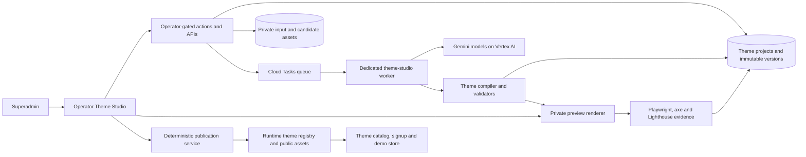

# Mink AI Theme Studio — implementation plan

> **Status:** Phases 0–5 are implemented: contracts, the runtime registry, the
> superadmin Studio shell with secure intake, the Gemini-on-Vertex generation
> pipeline (moved from Anthropic models on 2026-09-23, owner's decision),
> private previews with iterative revision, and automated acceptance.
> Operators replace placeholder images per slot, which is what lets a
> generated version pass acceptance. Phase 3 has not yet been run against a
> live model, and the offline provider stays the default until it has.
> Phases 6–7 remain proposed; no publication capability is available yet.
>
> **Plan date:** 2026-09-23
>
> **Audience:** StoreMink platform operators and engineers. This is not a
> merchant-facing Mink AI feature.

## 1. Executive decision

Build **Mink AI Theme Studio** as a superadmin-only workspace inside the
existing operator Themes area. An operator supplies a brief and optional
reference screenshots, chooses an allowlisted Gemini model served through
Vertex AI, reviews an immutable generated candidate at desktop/tablet/mobile
sizes, requests revisions, and explicitly publishes an approved release.

The model must generate a **validated StoreMink theme package**, not arbitrary
React, JavaScript, SQL, shell commands, or repository changes. The package is
data: catalog metadata, design tokens, approved layout variants, pages,
sections, menus, fixture content, and StoreMink-owned assets. The existing
multi-tenant storefront renderer remains the only code that executes.

This is the safest route to the requested Shopify-like outcome:

- themes remain editable in Website Builder after installation;
- every generated value crosses the same section, design, URL, accessibility,
  and asset validators as a hand-authored theme;
- previews use the real StoreMink renderer and commerce flows;
- a model cannot deploy executable code or publish by calling a tool; and
- published releases are immutable and stores remain pinned to the version
  they installed.

The Studio should initially publish a theme to the StoreMink theme catalog and
its live demo. It must **not** silently switch existing merchant storefronts.
Installing or upgrading a theme on an existing store remains a separate,
explicit action.

## 2. Existing foundation and the gap

StoreMink already has most of the product primitives:

- `/dashboard/themes` is a platform-only, superadmin-gated theme/demo console.
- `ThemeDefinition` is already a data package containing metadata, design,
  pages, menus, sample categories, products, and variants.
- `applyTheme` can seed a real demo store and pins the installed preset and
  engine versions.
- the section registry performs strict publish validation;
- theme acceptance already defines desktop, tablet, mobile, commerce,
  accessibility, performance, provenance, and two-reviewer gates; and
- Mink already has multimodal-input, proposal, immutable-version, audit,
  usage, retry, and long-running-workflow patterns that can be reused without
  exposing merchant conversations to the operator tool.

The blocking gap is that `THEME_META` and `THEME_DEFINITIONS` are compiled
TypeScript. An operator cannot create and publish a new theme without changing
source and deploying the application. Theme Studio therefore starts with a
runtime-backed, versioned theme registry while retaining the current bundled
definitions as a safe fallback during migration.

## 3. Product workflow

### 3.1 Entry and access

Add an **AI Theme Studio** action to `/dashboard/themes` and these routes:

```text
/dashboard/themes/studio
/dashboard/themes/studio/new
/dashboard/themes/studio/[projectId]
/dashboard/themes/studio/[projectId]/versions/[versionId]
```

Every page calls `requireOperator()` itself. Every read, upload, generation,
revision, validation, approval, publication, rollback, and deletion endpoint
also rechecks `requireSuperadmin()` server-side. Do not rely on the layout,
hidden navigation, or disabled controls as authorization.

Ordinary platform members may continue to see the existing read-only theme
catalog if desired, but must not see Studio prompts, reference images,
generated drafts, model choices, costs, or publication controls.

### 3.2 Create

The creation form captures:

- theme name and URL-safe id;
- target industries and catalog sizes;
- design brief and commercial goals;
- required pages/features;
- optional base theme or engine family;
- up to ten reference images; and
- one server-provided model choice.

Reference images are inspiration, not source assets. The UI must state that
StoreMink will extract layout, visual language, and responsive intent but will
not copy logos, text, product photos, or proprietary artwork.

Submitting creates the project and a queued run immediately. It does not hold
an HTTP request open while the model works.

### 3.3 Review and revise

When a candidate is ready, the workspace shows:

- a concise design rationale and assumptions;
- the manifest diff from its parent version;
- warnings and failed gates before any visual preview;
- a real storefront preview with Laptop (1440×900), iPad (768×1024), and
  Mobile (390×844) controls;
- page controls for home, shop, product detail, cart, one content page, and
  404;
- an open-in-new-window preview for actual-device testing;
- automated screenshots and validation reports; and
- a revision composer that accepts text plus new references.

Each revision creates a new immutable version with a `parent_version_id`.
Never edit the prior JSON in place. The operator can compare, restore, or
branch from any earlier version. A revision request always states which
version it targets; an optimistic lock refuses a stale tab instead of applying
feedback to the wrong candidate.

### 3.4 Approve and publish

Use the existing release vocabulary:

```text
draft -> generating -> ready -> candidate -> approved -> published
                         \-> failed / blocked
```

`Candidate` means deterministic package checks and the private demo passed.
`Approved` requires the current `docs/theme-acceptance.md` evidence, including
the two-person human scorecard. At least one reviewer must not be the operator
who authored the candidate. `Published` is a separate superadmin confirmation
that creates an immutable semantic version and exposes it to the catalog and
signup picker.

The model has no publish tool. The server refuses publication unless the exact
manifest digest, asset-set digest, preview build, and approval record still
match. The confirmation names the theme id/version, catalog exposure, demo
host, and any known exceptions.

## 4. Runtime architecture



### 4.1 Dedicated model boundary

Create a Theme Studio model adapter; do not add Theme Studio models to the
normal merchant Mink router or its dropdowns, even though both use Gemini.

Recommended boundary:

- a dedicated `theme-studio-worker` Cloud Run service;
- a dedicated service account with only the storage, queue, logging, and
  Vertex permissions needed by this workload;
- a separate code-owned model allowlist, exposed to the browser as labels and
  opaque keys only;
- server-side resolution from key to exact provider model id; and
- no generic `model` string accepted from a form or API body.

Initial logical choices:

| UI key             | Provider model           | Use                                                    |
| ------------------ | ------------------------ | ------------------------------------------------------ |
| `gemini-3.8-flash` | `gemini-3.8-flash`       | default for analysis and package synthesis             |
| `gemini-3.1-pro`   | `gemini-3.1-pro-preview` | deeper reasoning for hard briefs (Preview; never only) |

Provider ids, region support, launch status, terms, and quota must be verified
in the target GCP project before a choice becomes enabled. Keep the mapping in
server configuration so a provider rename or dated version does not alter
stored history. Each run records both the stable UI key and the resolved model
id.

Gemini models are Google first-party publisher models: no Model Garden
partner enablement is needed, only the Vertex AI API and
`roles/aiplatform.user`. Calls use `@google/genai` in Vertex mode with ADC;
never store a Gemini API key for Theme Studio.

### 4.2 Durable asynchronous runs

Theme generation is a long-running, retryable job and should not execute in a
server action. A server action validates intake, writes the project/run in one
transaction, uploads accepted references, and enqueues a task. The worker:

1. claims the run with a lease;
2. records model id, prompt version, input digests, and parent version;
3. calls the provider with bounded retries and an overall deadline;
4. validates and repairs structured output within a small fixed attempt limit;
5. stores an immutable candidate or a safe failure code;
6. queues preview materialization and automated checks; and
7. writes token, cache, latency, retry, and estimated-cost telemetry.

Every task is idempotent on `run_id`. A retry may resume a checkpoint but may
never create a second version or publish. The UI polls a bounded status API or
uses SSE for progress; reconnecting must not restart work.

### 4.3 Two-stage model protocol

Do not ask the model to jump from screenshots directly to a final package.

**Stage A — reference analysis** runs without publication or database tools and
produces a strict `ThemeIntent` object:

- audience, vertical, assortment and conversion goal;
- visual attributes, palette direction, typography character and density;
- page-by-page information hierarchy;
- desktop/tablet/mobile composition decisions;
- reusable section/variant requirements;
- asset briefs and crop/focal-point rules; and
- explicit unknowns and assumptions.

Text found inside a screenshot is untrusted reference content, not an
instruction. The schema has no field for system instructions, credentials,
scripts, copied marketing copy, or external actions.

**Stage B — package synthesis** receives the validated intent, StoreMink's
theme schema, section catalog, responsive contracts, and commerce invariants.
It returns one complete `ThemePackageV2` JSON object. The application parses
it with strict schemas, drops unknown fields, resolves only registered section
and layout variants, normalizes URLs, and then runs the same validators used by
publication. A repair prompt may receive validator errors, never secrets or
arbitrary database results.

## 5. Theme package and registry design

### 5.1 `ThemePackageV2`

The generated contract should extend today's `ThemeDefinition` while staying
declarative:

- identity and catalog metadata;
- engine id/version and minimum StoreMink renderer version;
- complete design tokens and approved font ids;
- header, footer, card, PDP, cart, collection, and search variants;
- pages with strictly validated sections;
- menus;
- demo categories, products, variants, edge-case fixtures, and copy;
- asset references by immutable asset id, never arbitrary remote URL;
- declared capabilities, breakpoints, aspect ratios, and focal points; and
- provenance, prompt version, generator model, and package digest.

If a requested look cannot be represented by the current block/variant/token
vocabulary, the run should report a **capability gap**. Do not hide the gap in
custom code. A reviewed engine/section enhancement can be implemented and
deployed separately, after which the candidate can be regenerated. This keeps
the Studio from becoming a production remote-code-execution surface.

### 5.2 Runtime registry

Add a repository layer that resolves themes from:

1. published database-backed releases; then
2. existing bundled definitions as the migration fallback.

The resolver is server-only and cache-tagged by theme id/version. Public
catalog and signup pages receive a small serializable metadata projection from
the server instead of importing a compile-time array. Stores continue to pin
`presetId`, `presetVersion`, `engineId`, and `engineVersion`.

Publishing never overwrites a release. A changed candidate receives a new
semantic version. Removing a release from new installs changes catalog
visibility only; already-installed stores continue to resolve their pinned
release. Keep a tested emergency fallback snapshot for every published
manifest.

### 5.3 Proposed persistence

Use a forward-only migration for these service-owned tables:

| Table                      | Purpose                                                                  |
| -------------------------- | ------------------------------------------------------------------------ |
| `theme_studio_projects`    | identity, status, current version, creator, timestamps                   |
| `theme_studio_messages`    | bounded operator prompts/revision feedback and attachment refs           |
| `theme_studio_runs`        | model/prompt versions, status, lease, usage, cost, error codes           |
| `theme_studio_versions`    | immutable parent-linked intent, manifest, digests, diff summary          |
| `theme_studio_assets`      | private/public object keys, type, size, dimensions, checksum, provenance |
| `theme_validation_runs`    | validator version, route/viewport results, reports and screenshot refs   |
| `theme_review_approvals`   | release digest, reviewer, role, scorecard and decision                   |
| `theme_releases`           | immutable semantic release, catalog state, published actor/time          |
| `theme_publication_events` | append-only publish, hide, restore and rollback audit trail              |

No table should use merchant RLS as its primary boundary; these are platform
records read through service scope only after an operator gate. Database
constraints should enforce state vocabulary, positive version numbers,
unique `(theme_id, version)`, immutable release digests, allowed model keys,
and valid publication transitions.

## 6. Assets and reference-image handling

- Upload directly to a private GCS prefix using a short-lived signed upload.
- Accept only JPEG, PNG, WebP, and AVIF after magic-byte decoding; reject SVG,
  HTML, archives, animated files, and filename-derived trust.
- Enforce count, per-file, total-byte, pixel-count, and dimension limits.
- Decode and re-encode accepted images to remove metadata and malformed
  payloads before model use.
- Store SHA-256, dimensions, media type, uploader, and purpose.
- Serve candidate assets only through short-lived operator preview URLs.
- On publication, copy the exact approved asset digests to a versioned public
  CDN prefix; never publish the original reference screenshots.
- Require every published asset to record `generated`, `operator-owned`, or
  `licensed` provenance plus any source/license note.

The selected Gemini models produce text, not final raster theme photography.
For the first release, use operator-provided licensed assets or a curated
StoreMink asset library. A later image-generation step may reuse StoreMink's
existing media pipeline, but it needs its own prompt, provenance, crop, and
approval records and must never copy a reference site's assets.

## 7. Preview, validation, and release evidence

### 7.1 Private full-fidelity preview

Materialize each candidate into an isolated preview store or equivalent
explicit-store render context. It must use the real storefront renderer,
queries, fixtures, and routes—not a screenshot or a second miniature renderer
inside the operator page.

Preview access uses a short-lived, version-bound signed token plus an active
superadmin session. Preview stores are marked `demo`, `noindex`, excluded from
sitemaps/analytics/search, unable to accept real checkout/payment, and cleaned
up after a retention window. The token binds project, version, operator, and
expiry and is never accepted by normal merchant hosts.

The viewport buttons resize the iframe; they do not claim to replace real
device testing. The Candidate gate also captures full-page screenshots at the
three acceptance viewports, and the reviewer can open the exact version on a
physical device.

### 7.2 Deterministic gates

Move the reusable assertions in `lib/themes/themes.test.ts` into production
validation functions, then have Vitest test those functions. A candidate runs:

1. schema, metadata, package, URL, section, menu, design-token, font, and
   capability validation;
2. asset existence, checksum, size, dimensions, format, crop, and provenance;
3. demo materialization with zero seed warnings;
4. route checks for home, shop, PDP, cart, content page, and 404;
5. interaction tests for navigation, search, variants, add-to-cart, cart
   changes, long content, missing media, and reduced motion;
6. horizontal-overflow and screenshot-diff checks at 1440×900, 768×1024, and
   390×844;
7. axe/Lighthouse accessibility checks and contrast validation;
8. production-build performance checks using the existing thresholds:
   Performance >= 90, LCP <= 2.5 s, CLS < 0.1, INP <= 200 ms; and
9. a security scan proving that no scripts, event handlers, external asset
   URLs, unknown CSS values, or unregistered capabilities reached the package.

Failure keeps the version in `draft` or moves it to `blocked`; it does not
publish with a warning. Reports are tied to exact manifest/build/asset digests
so changing any input invalidates approval.

### 7.3 Human gate

Reuse `docs/theme-acceptance.md` rather than inventing a lighter AI-specific
standard. The Studio should render its scorecard and require two approvals,
including one non-author reviewer. Automatic rejection still applies when the
candidate is merely an existing theme with new colors/order, copies another
site, leaves core commerce surfaces generic, depends on custom code, or shows
placeholder/inaccessible content.

## 8. Publication and rollback

Publication is one deterministic transaction/orchestrated operation:

1. acquire a project publication lock;
2. re-read the exact approved version;
3. verify manifest, assets, validation run, demo build, and approvals by digest;
4. allocate the semantic version without overwriting another release;
5. promote approved assets to the immutable public prefix;
6. write the immutable `theme_releases` row;
7. seed/reseed the live `demo-{theme-id}` store and require zero errors;
8. mark catalog visibility public and release status published;
9. invalidate theme, catalog, signup, demo, and sitemap cache tags; and
10. append a publication event with actor and before/after state.

If demo seeding or final verification fails, catalog exposure stays hidden and
the operation is retryable. A model completion alone can never create a
release.

Rollback has two distinct actions:

- **hide from new installs**: remove catalog/signup visibility while preserving
  existing pinned installations; and
- **restore catalog pointer**: make a prior approved release current for new
  installs without mutating either release.

Forcing existing stores to another release is a separate migration product and
is out of scope because it could overwrite merchant-edited content.

## 9. Security, privacy, and cost controls

- Operator auth is checked at the page and every independently callable write.
- Only superadmins can generate, approve publication, publish, hide, or restore.
- The worker receives project/version ids, not an operator-supplied store id,
  file path, URL, tool name, model id, or SQL fragment.
- References and prompt text are treated as untrusted data and never become
  system instructions.
- No browsing, URL fetching, shell, repository, database, publish, or generic
  HTTP tool is exposed to the model.
- Use output-token, wall-time, retry, repair-attempt, input-byte, attachment,
  section, page, and asset ceilings.
- Add per-operator concurrency and daily spend caps plus a global emergency
  stop independent of merchant `MINK_AI_ENABLED`.
- Show an estimated ceiling before generation and actual input/output/cache
  usage and estimated Vertex cost after each run.
- Redact prompts from ordinary platform telemetry. Detailed project content is
  visible only inside the superadmin workspace; operational logs use run id,
  model, status, latency, usage, validator codes, and safe error codes.
- Define retention for rejected references, prompts, candidates, provider
  request/response logging, previews, and screenshots before launch. The UI
  must disclose any provider abuse-monitoring retention required by enabled
  models.

## 10. Delivery sequence

### Phase 0 — contracts and threat model ✅

Deliver:

- product states, role matrix, misuse cases, retention decision, budget limits;
- `ThemeIntent` and `ThemePackageV2` schemas;
- capability-gap behavior;
- 25–50 evaluation briefs covering verticals, screenshot attacks, copied
  content, bad assets, mobile composition, accessibility, and commerce edges;
- provider/model enablement spike for each dropdown choice; and
- ADR for the dedicated worker and runtime theme registry.

Exit: the schemas can represent existing Basket, Studio, Ritual, and Vitrine
without loss, and the threat model has owners for every high-risk item.

Implementation record: `docs/mink-ai-theme-studio-phase0.md`. The target-GCP
live model probe remains a deployment prerequisite; the executable probe and
its non-networking dry-run are included in Phase 0.

### Phase 1 — runtime registry ✅

Deliver:

- database release repository and cache tags;
- bundled-definition fallback and migration/import command;
- async theme resolution at storefront, catalog, signup, and demo call sites;
- immutable version pinning and restore behavior; and
- regression tests proving all existing themes render unchanged.

Exit: one manually inserted database-backed candidate can be previewed and one
published test release can be selected without an application deploy.

Implementation record: `docs/mink-ai-theme-studio-phase1.md`. The operator
Studio shell remains Phase 2; Phase 1 exposes exact candidate resolution to
that future preview path but adds no operator page of its own.

### Phase 2 — Studio shell and secure intake ✅

Deliver:

- project list/detail/new routes under `/dashboard/themes/studio`;
- superadmin actions and service-only repository reads;
- private signed uploads, sanitization, reference gallery, model dropdown;
- immutable messages/runs/versions and audit events; and
- queue/worker status UI with cancel/retry.

Exit: an operator can create a project and queue a fake provider run; a member
or forged request cannot read or mutate it.

Implementation record: `docs/mink-ai-theme-studio-phase2.md`. References are
stored sanitized in a service-only table rather than a private GCS prefix,
because the media bucket is public; revisions, the retention sweep and draft
brief editing remain later work.

### Phase 3 — Gemini generation pipeline ✅

Deliver:

- dedicated Gemini-on-Vertex client and server allowlist;
- Stage A intent analysis and Stage B package synthesis;
- strict parsing, bounded repair loop, prompt/version capture, idempotent jobs;
- usage/cost telemetry and emergency controls; and
- model-evaluation harness against the Phase 0 set.

Exit: each enabled model produces valid immutable candidates from text and
images, and malformed/prompt-injected output fails closed.

Implementation record: `docs/mink-ai-theme-studio-phase3.md`. Images are
server-generated placeholders marked in the package, which publication must
refuse. Model runs execute on a dedicated internal worker route that needs its
own Scheduler job and a longer Cloud Run timeout before `vertex-gemini` is
enabled. The live evaluation per model is the remaining gate: until it passes,
the exit criterion is met only up to the provider boundary.

### Phase 4 — preview and iterative revision ✅

Deliver:

- private preview materialization and token-bound routes;
- laptop/iPad/mobile viewport UI and full-page pop-out;
- page/commerce navigation, version diff, compare, restore, and branch;
- revision jobs bound to a parent digest; and
- cleanup/retention worker for abandoned preview data.

Exit: an operator can complete the requested create-review-revise loop without
touching source code or public catalog state.

Implementation record: `docs/mink-ai-theme-studio-phase4.md`. A preview is a
hidden, demo-flagged store per version, gated in the store resolver. Where the
platform session is host-only (local development) the gate is the signed grant
plus a per-request re-check that its actor is still a superadmin, rather than
the session itself. Compare is a structured diff with a preview link for each
side, not two synchronised frames. Placeholder images are served publicly,
because next/image cannot forward a session.

### Phase 5 — automated acceptance ✅

Deliver:

- production validator extraction from theme tests;
- Playwright route/interaction/responsive suite;
- axe, contrast, Lighthouse, asset, provenance, and security gates;
- evidence viewer tied to digests; and
- candidate/block state transitions.

Exit: a candidate cannot reach human approval with a failed required gate, and
changing its manifest or assets invalidates prior evidence.

Implementation record: `docs/mink-ai-theme-studio-phase5.md`. The theme
package rules are production functions in `lib/themes/validation.ts`. The
server stage fetches the preview's rendered pages through the server itself.
The browser stage measures overflow, axe and media in the operator's own
browser at the three viewports; the server applies every threshold. The
database refuses `candidate` without a passed run over the exact package
digest, and evidence is bound to the package, asset bytes and build. Not
built:

- Playwright, screenshot diffs, interaction tests and a reduced-motion pass;
- Lighthouse against a production build (performance is recorded as advisory).

Operator images per slot followed Phase 5
(`docs/mink-ai-theme-studio-slot-images.md`). An operator uploads an image for
each slot; it is cropped to the slot's shape and compressed to storefront
limits, and the staged images are saved as one new version. Revisions keep
uploaded images for slots that keep their id and shape. Phase 6 promotes
them to the public immutable prefix at publication.

### Phase 6 — approval, publication, and rollback ✅

Deliver:

- two-reviewer scorecard and non-author rule;
- semantic release allocation and publish confirmation;
- zero-warning live demo promotion;
- public catalog/signup exposure and cache invalidation;
- hide/restore controls and immutable publication audit; and
- staging canary plus production runbook.

Exit: a full staging theme goes from prompt to published catalog release, is
installable on a fresh store, and can be hidden/restored without changing an
existing store's pinned version.

Implementation record: `docs/mink-ai-theme-studio-phase6.md`.

- **Reviews.** The §5 scorecard is stored as columns, so the approval bar is
  a database CHECK. Reviews bind to the latest passing acceptance run, and
  the database refuses `approved` without an approving review from each
  chair, one of them by a non-author.
- **Publication** follows §8. The operator types the theme id to confirm.
  Images are copied to `theme-releases/<theme>/<version>/` in the media
  bucket, the one https path the package contract admits. The immutable
  release is written, and `demo-<theme>` is seeded from it and rendered as a
  themed 200 on four surfaces. Only then does one transaction point the
  catalog at the release and mark the project published. A failure leaves
  the theme hidden, and the retry resumes the same release.
- **Rollback.** Hide, show, or restore a published release, each audited in
  `theme_catalog_audit`. Stores pinned to a release are never touched.

The flow was verified end to end against the local database and dev server,
with storage injected. The **staging canary** — a real model run reviewed by
two superadmins — has not been run; it is the remaining step of this exit
criterion, and the runbook is in the implementation record §9.

### Phase 7 — quality expansion

Only after production evidence:

- add new shared section/layout variants for recurring capability gaps;
- add approved image-generation integration and asset-library search;
- add side-by-side model evaluation and default-model recommendations;
- add branch merging only if actual operator usage needs it; and
- consider a reviewed code-backed engine pipeline that creates a PR and
  requires normal CI/deploy—never direct in-app execution or publication.

## 11. Test plan

At minimum, add tests for:

- page/action authorization and direct POST attempts by non-superadmins;
- model allowlist bypass, unknown/deprecated ids, and region mismatch;
- upload spoofing, oversized/decompression-bomb images, metadata stripping,
  token expiry, and cross-project asset access;
- prompt injection in image text and operator prompt;
- strict schema parsing, unknown fields, external URLs, bad fonts/colors,
  scripts/event handlers, and unsupported variants;
- job replay, lease expiry, cancellation, timeout, provider 429/5xx, repair
  exhaustion, and no duplicate version on retry;
- stale-parent revision refusal and version/diff integrity;
- preview-token user/project/version binding and noindex/payment disabling;
- every gate in `docs/theme-acceptance.md` against generated packages;
- approval invalidation after manifest/asset/build changes;
- concurrent publication, partial asset promotion, demo-seed failure, retry,
  hide, restore, and cache invalidation;
- existing bundled-theme compatibility and pinned old-release resolution; and
- proof that merchant Mink APIs and model selectors cannot request any Theme
  Studio model.

Use mutation tests for authorization, digest binding, publication state
transitions, and model allowlisting; these are the places where a removed line
must make a test fail.

## 12. Expected implementation map

Names are proposed and should be adjusted to local conventions during delivery.

```text
app/platform/dashboard/(console)/themes/
  page.tsx
  studio/page.tsx
  studio/new/page.tsx
  studio/[projectId]/page.tsx
  studio/[projectId]/versions/[versionId]/page.tsx

app/api/platform/theme-studio/
  uploads/route.ts
  projects/[projectId]/status/route.ts
  preview/[versionId]/route.ts

app/api/internal/theme-studio/
  runs/[runId]/route.ts
  validations/[versionId]/route.ts

lib/theme-studio/
  access.ts
  repository.ts
  models.ts
  gemini-vertex.ts
  intent-schema.ts
  package-schema.ts
  prompts.ts
  worker.ts
  compiler.ts
  assets.ts
  preview.ts
  validation.ts
  publication.ts
  telemetry.ts

lib/themes/
  repository.ts
  validation.ts

drizzle/migrations/sql/
  <timestamp>_mink_ai_theme_studio.sql
```

Do not place cross-platform reads in a `"use server"` module. Keep core reads
and business logic in `lib/theme-studio/`; server actions are small,
independently authorized mutation adapters.

## 13. Deployment prerequisites

- Enable the Vertex AI API in the target project and confirm both Gemini ids
  resolve (`npm run theme-studio:model-check`, the free `countTokens` call).
- Confirm the exact provider id and endpoint for every dropdown entry with a
  startup/health probe; disable unavailable entries rather than falling back to
  another model silently.
- Decide global versus regional processing and document the residency impact.
- Provision the dedicated worker service account, Cloud Tasks queue, private
  candidate bucket/prefix, public immutable asset prefix, budgets, quotas,
  alerts, and emergency stop.
- Set retention and request/response logging policy before sending real
  references.
- Run the full flow in local fixtures, staging, and a non-public canary theme
  before production publication is enabled.

## 14. Documentation obligations

Implementation changes must update in the same commit:

- `CODEBASE.md` for the new routes, services, tables, worker, runtime registry,
  security boundary, and publication behavior;
- `docs/theme-acceptance.md` for any new package/runtime/preview/release stories;
- `docs/theme-assets.md` or its database-backed successor for published asset
  provenance;
- `docs/operator-console.md` for the operator workflow and role rules;
- `docs/gcp-ci-cd.md` and/or `docs/cron-jobs.md` for worker, queue, IAM,
  environment, deployment, and operations; and
- this plan as phases finish or split.

This capability is operator-only. It does not change what a merchant or shopper
does merely by being implemented, so there should be **no Help Centre
migration** for the Studio itself. A later merchant-visible theme installation
or upgrade flow must pass the Help Centre gate separately.

## 15. Launch definition

The first production release is complete only when:

- only superadmins can access any Studio data or action;
- text plus reference images can produce an immutable validated candidate with
  an explicitly selected allowlisted Gemini model;
- every revision creates a traceable child version;
- the real storefront can be reviewed at the three required viewports and on a
  physical device;
- all package, commerce, accessibility, performance, provenance, security, and
  two-reviewer gates are stored against exact digests;
- the model cannot publish or execute arbitrary code;
- a superadmin can publish an approved release without an app deploy;
- the release appears in the catalog/signup and its live demo passes with zero
  seed errors;
- existing stores are not changed; and
- the release can be hidden or a prior release restored without corrupting a
  pinned installation.

## 16. Provider references checked for this plan

- Google AI: [Gemini API pricing](https://ai.google.dev/gemini-api/docs/pricing) (the rates in `lib/theme-studio/cost.ts`)
- Google AI: [Structured output](https://ai.google.dev/gemini-api/docs/structured-output) (the supported JSON Schema subset)
- Google AI: [Thinking](https://ai.google.dev/gemini-api/docs/thinking) (`thinkingLevel`)
